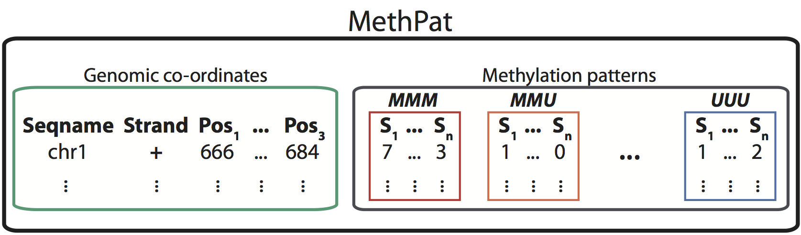

```{r setup, include = FALSE}
knitr::opts_chunk$set(echo = FALSE,
                      comment = "#>")
```

## The problem

Analyse data from [_methtuple_](https://github.com/PeteHaitch/methtuple) in R

```
# Toy data for one sample
chr  strand pos1  pos2  pos3  MMM MMU MUM MUU UMM UMU UUM UUU
chr1 *      666   670   684   7   1   0   0   1   0   0   1
chr1 *      670   684   699   6   0   0   0   2   0   0   0
```

## The problem

Analyse data from [_methtuple_](https://github.com/PeteHaitch/methtuple) in R

```
# Toy data for one sample
chr  strand pos1  pos2  pos3  MMM MMU MUM MUU UMM UMU UUM UUU
chr1 *      666   670   684   7   1   0   0   1   0   0   1
chr1 *      670   684   699   6   0   0   0   2   0   0   0
```

Want:

<center></center>


## _GenomicTuples_

A drop in replacement for [_GenomicRanges_](http://bioconductor.org/packages/GenomicRanges/) for when your data are described by _tuples_ of genomic positions:

```{r, warning = FALSE, message = FALSE}
library(GenomicTuples)
GTuples(seqnames = c("chr1", "chr1"),
        strand = c("*", "*"),
        tuples = matrix(c(666, 670, 684, 
                          670, 684, 699),
                        ncol = 3, byrow = TRUE))
```

See [http://bioconductor.org/packages/GenomicTuples/](http://bioconductor.org/packages/GenomicTuples/)

## _MethylationTuples_ 

_MethylationTuples::MethPat_ class extends [_SummarizedExperiment_](http://bioconductor.org/packages/SummarizedExperiment/) (devel) package.

<center></center>

See [https://github.com/PeteHaitch/MethylationTuples](https://github.com/PeteHaitch/MethylationTuples) (__but changes coming__)
